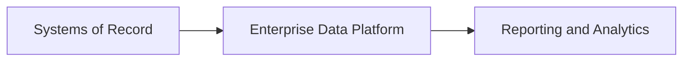
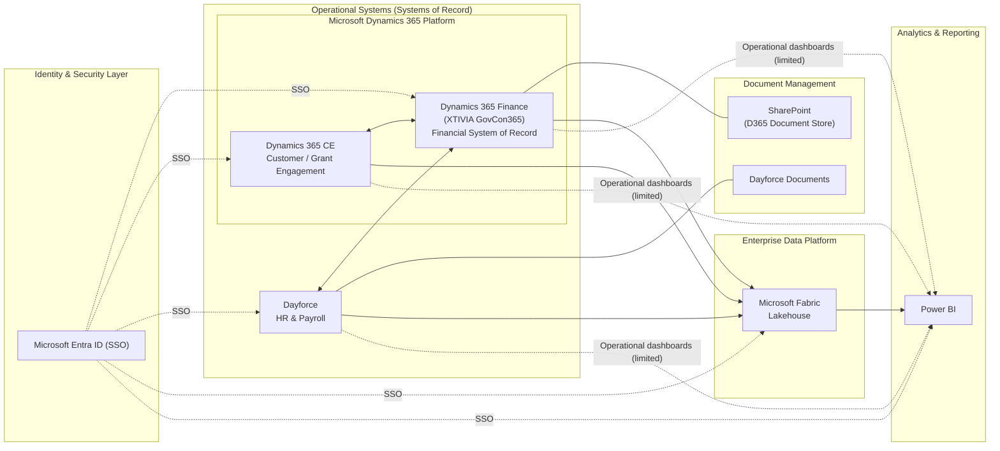
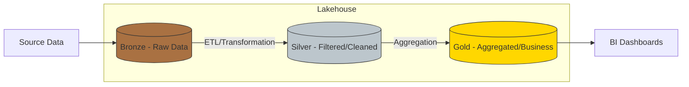
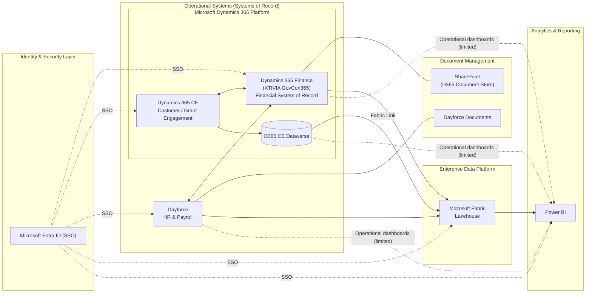

# AIR
This is a location for editing Mermaid files for the ConOps and other documents.

Systems of Record → Enterprise Data Platform → Reporting and Analytics 

High level target state diagram.

Medalion Architecture

Low level target state diagram.

