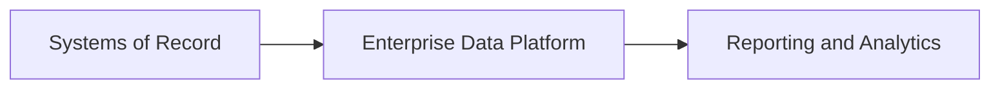
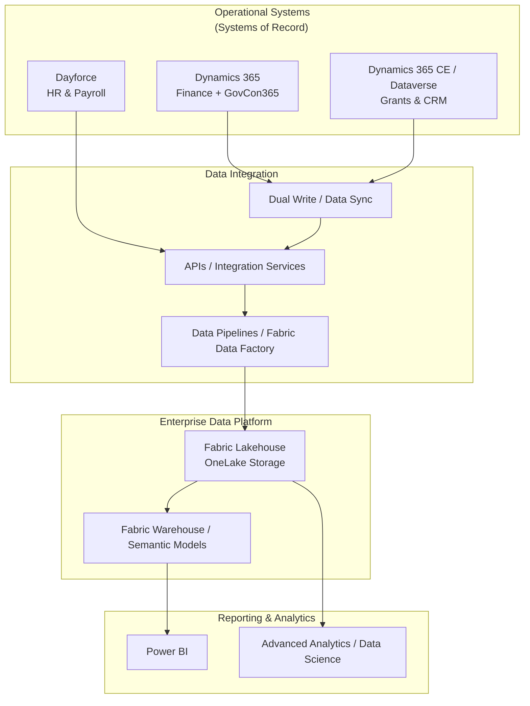
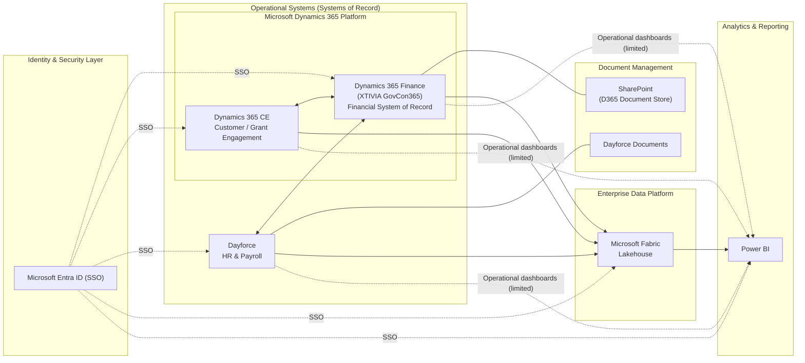
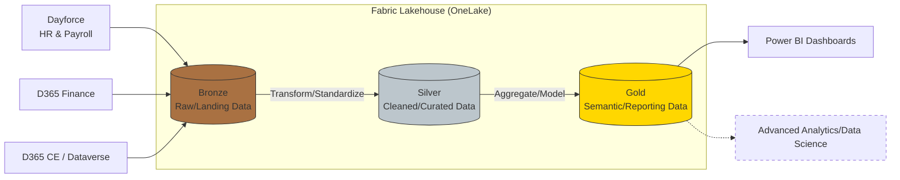
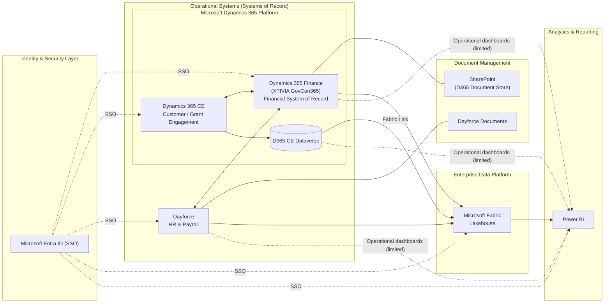
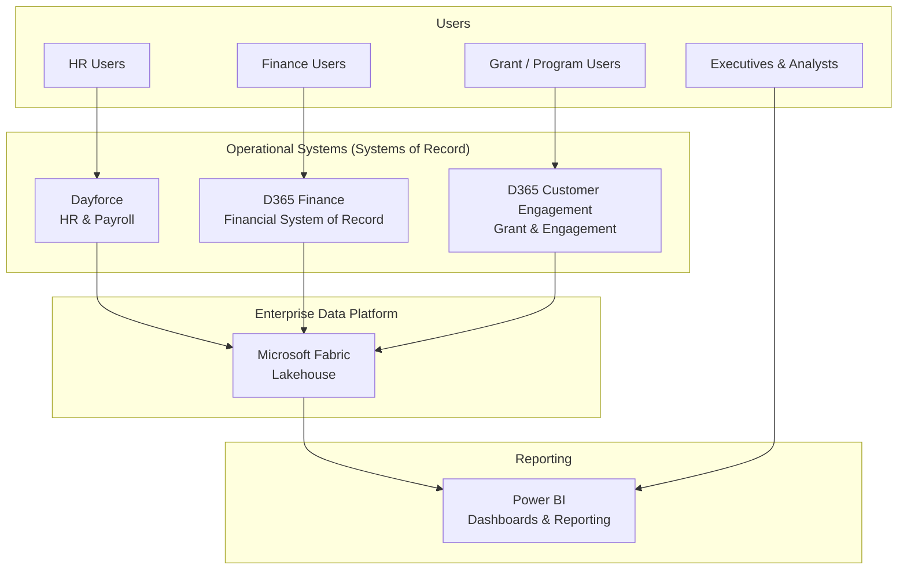
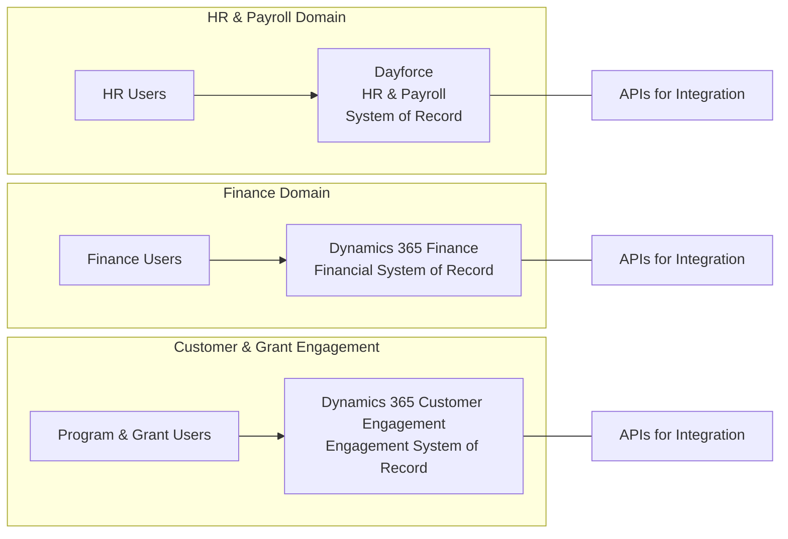
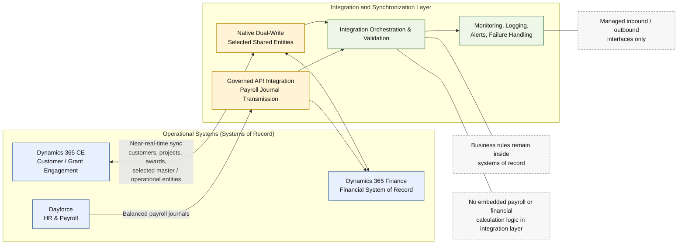
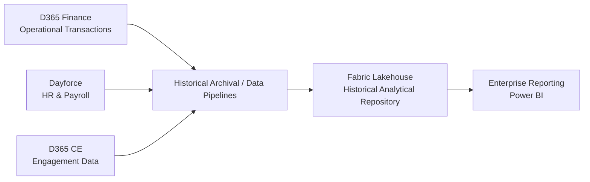
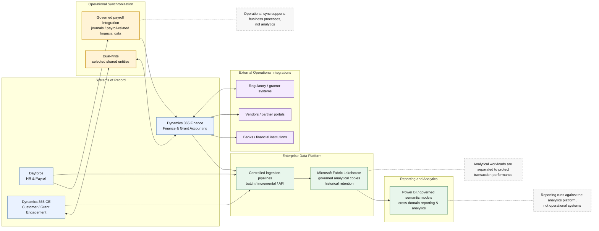

# AIR
This is a location for editing Mermaid files for the ConOps and other documents.

Systems of Record → Enterprise Data Platform → Reporting and Analytics 

High Level D365 + Fabric reference diagram

High level target state diagram.

Medalion Architecture

Low level target state diagram.

ConOps Section 4: Operational Concept

ConOps Section 5.2: Operational Systems (Systems of Record)

ConOps Section 5.3: Integration and Synchronization Layer

ConOps Section 6: Data Concept

ConOps Section 6.2: Data Flow

