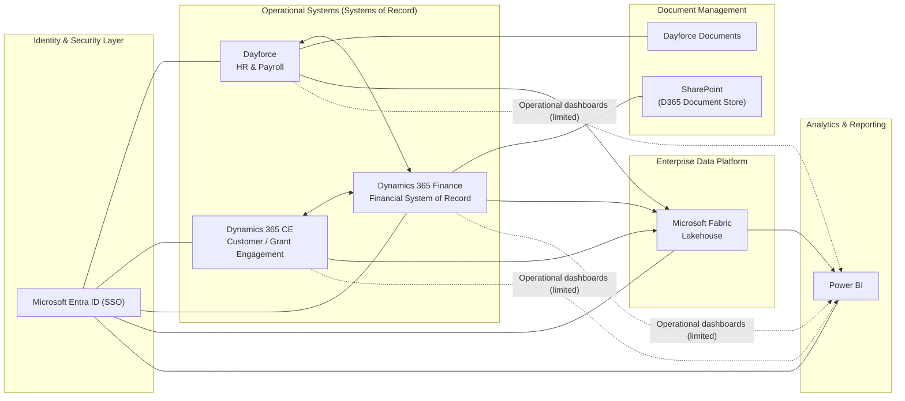

# AIR
This is a location for editing Mermaid files for the ConOps and other documents.

High level target state diagram.

```mermaid
flowchart LR

  subgraph Identity["Identity & Security Layer"]
    Entra["Microsoft Entra ID (SSO)"]
  end

  subgraph Operational["Operational Systems (Systems of Record)"]
    DF["Dayforce\nHR & Payroll"]
    CE["Dynamics 365 CE\nCustomer / Grant Engagement"]
    FIN["Dynamics 365 Finance\nFinancial System of Record"]
  end

  subgraph Documents["Document Management"]
    SP["SharePoint\n(D365 Document Store)"]
    DFDOC["Dayforce Documents"]
  end

  subgraph Data["Enterprise Data Platform"]
    FAB["Microsoft Fabric\nLakehouse"]
  end

  subgraph Analytics["Analytics & Reporting"]
    PBI["Power BI"]
  end

  %% Identity
  Entra --- DF
  Entra --- CE
  Entra --- FIN
  Entra --- FAB
  Entra --- PBI

  %% Operational sync relationships
  DF <--> FIN
  CE <--> FIN

  %% Documents
  FIN --- SP
  DF --- DFDOC

  %% Primary reporting path (governed analytics)
  DF --> FAB
  CE --> FAB
  FIN --> FAB
  FAB --> PBI

  %% Optional operational reporting (direct-to-SOR)
  DF -. "Operational dashboards (limited)" .-> PBI
  CE -. "Operational dashboards (limited)" .-> PBI
  FIN -. "Operational dashboards (limited)" .-> PBI
```
